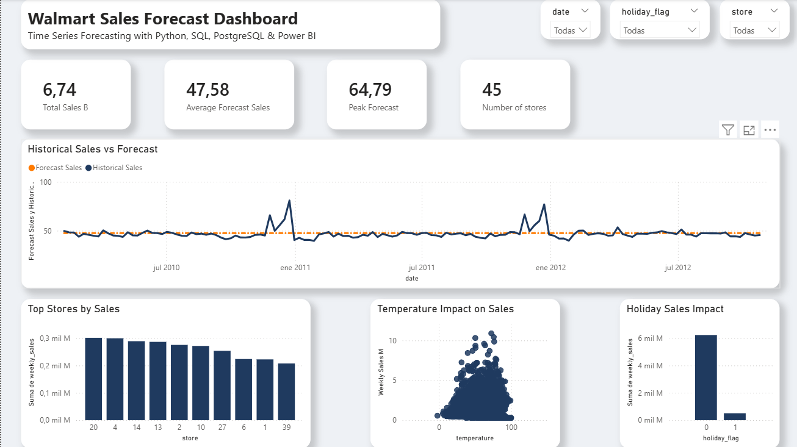

# Walmart Sales Forecast Dashboard

Time series forecasting project using Python, SQL, PostgreSQL and Power BI.

---

## Project Overview

This project analyzes Walmart sales data and builds a forecasting dashboard to compare historical sales with predicted sales trends.

The workflow includes:

- Data cleaning with Python
- Sales forecasting using Prophet
- SQL/PostgreSQL analysis
- Interactive dashboard development in Power BI

---

## Tools & Technologies

- Python
- Pandas
- Prophet
- PostgreSQL
- SQL
- Power BI
- GitHub

---

## Dashboard Features

- Historical Sales vs Forecast comparison
- Top performing stores
- Temperature impact on sales
- Holiday sales impact
- Interactive filters by:
  - Date
  - Store
  - Holiday flag

---

## Dashboard Preview



---

## Project Structure

```bash
walmart-sales-forecast/
│
├── data/
├── notebooks/
├── powerbi/
├── sql/
├── images/
├── README.md
└── requirements.txt
```

---

## Forecasting Model

The forecasting model was built using Facebook Prophet for time series prediction.

The model predicts future Walmart sales trends based on historical weekly sales data.

---

## How to Run

### 1. Clone the repository

```bash
git clone https://github.com/ValeriaVillegas/walmart-sales-forecast.git
```

### 2. Install dependencies

```bash
pip install -r requirements.txt
```

### 3. Run the notebook

Open the notebook inside the `notebooks/` folder.

### 4. Open Power BI Dashboard

Open the `.pbix` file located inside the `powerbi/` folder.

---

## Dashboard Insights

### Historical Sales vs Forecast
Compares real Walmart weekly sales against forecasted sales values over time.

### Top Stores by Sales
Shows the stores with the highest sales performance.

### Temperature Impact on Sales
Analyzes the relationship between temperature and weekly sales.

### Holiday Sales Impact
Compares sales behavior during holiday and non-holiday periods.

---

## Future Improvements

- Add advanced forecasting models
- Include anomaly detection
- Deploy dashboard online
- Add automated ETL pipeline

---

## Author

Valeria Villegas

- GitHub: https://github.com/ValeriaVillegas
